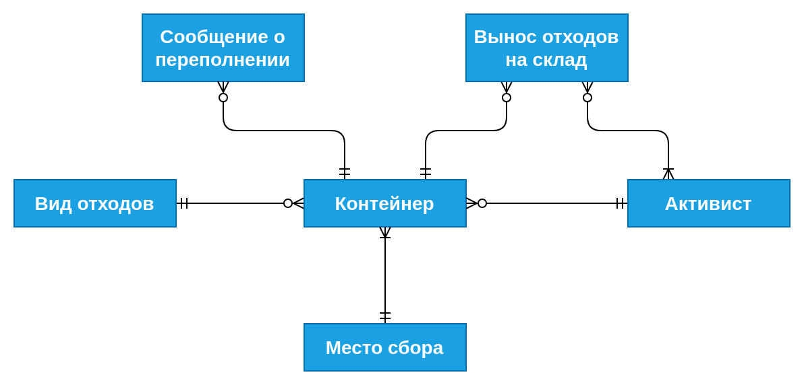
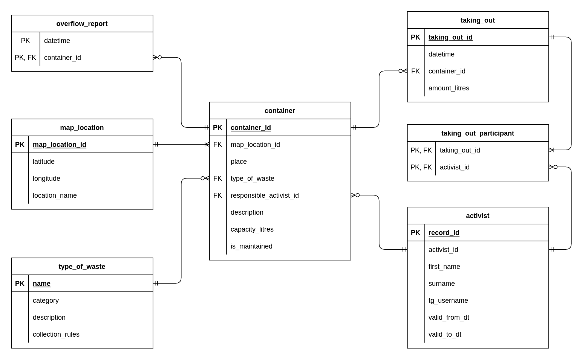

### Концептуальная модель

### Логическая модель

### Физическая модель

Описание хранения таблиц в СУБД: [docs/physical-model.md](docs/physical-model.md)

---

`container`  
У каждого контейнера есть идентификатор (не обязательно последовательный),
информация о его расположении, тип отходов, ссылка на активиста,
ответственного за контейнер, описание, вместимость в литрах и флаг,
обслуживается ли сейчас контейнер.

`type_of_waste`  
Для каждого типа отходов хранятся его уникальное название, категория
(твёрдый пластик, макулатура, мелочи) и правила сбора (текст, объясняющий, что
можно сдавать, что нельзя, и как это подготовить).

`map_location`  
У каждого места сбора есть идентификатор (не обязательно последовательный),
его название (2ка, 6ка, ГК) и географические координаты.

`activist`  
Для каждого активиста хранятся идентификатор (не обязательно последовательный),
имя, фамилия и имя пользователя в tg. Таблица сделана версионной
с использованием SCD 2 из соображения, что с течением времени может измениться
tg человека, или даже имя/фамилия, активист может прийти или уйти.

`taking_out`  
В журнале выноса отходов на склад хранятся идентификатор записи, время выноса,
из какого контейнера вынесли отходы, и сколько их в литрах.

`taking_out_participant`  
Для каждого выноса отходов на склад хранятся ссылки на вынесших их активистов.

`overflow_report`  
В таблице перечислены все сообщения о том, что какой-то контейнер переполнился,
и пора выносить собранные отходы на склад: хранятся время сообщения и ссылка
на контейнер.

---

БД имеет 2НФ, т.к.:

- Она имеет 1НФ, т.е. все атрибуты атомарны (сущность "Вынос отходов на склад"
декомпозирована на две таблицы, чтобы отразить в базе список активистов,
вынесших отходы из одного контейнера вместе)

- Любой неключевой атрибут зависит от ключа целиком (во всех таблицах либо
ключ простой, либо нет неключевых атрибутов)

При этом БД не имеет 3НФ: например, в таблице `map_location` совокупность
`(latitude, longitude)` является потенциальным ключом, и от неё зависит
`location_name`. Разные варианты решения проблемы по-своему неудобны:

- Если убрать суррогатный ключ и сделать `(latitude, longitude)` первичным
ключом, то неудобно ссылаться на локации из таблицы `container`

- Если убрать суррогатный ключ и сделать ключом `location_name`, то в ситуации,
если `location_name` внезапно поменяется, придётся менять все ссылки на локации

- Если хранить информацию о локациях не отдельно, а в таблице `container`,
могут возникать различные аномалии, и вообще это нелогично, если хочется
выделять сущность "Место сбора"
